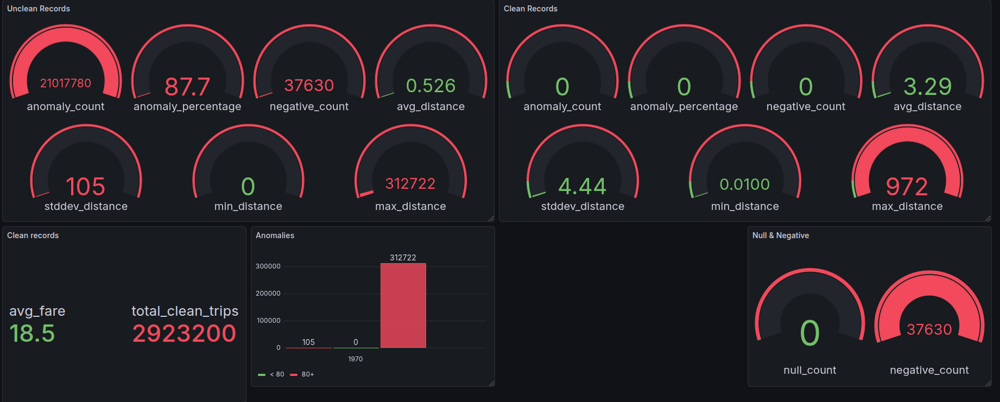

# Real-Time Revenue Market Balance Optimization System
# Dashboard

Below is a preview of the system dashboard:

## Project Goal
This project aims to analyze and optimize the revenue and market balance of NYC taxi services using real-time and historical data. The system leverages ClickHouse for fast analytical queries and Grafana for interactive data visualization. The primary objectives are to:
- Detect and analyze anomalies in taxi trip data
- Clean and validate large-scale datasets
- Visualize trends and data quality improvements
- Enable data-driven decision-making for market optimization

## Progress Summary (as of December 2025)
- **Data Ingestion:** NYC taxi data loaded into ClickHouse
- **Anomaly Detection:** SQL queries created to identify invalid, zero, and negative values
- **Data Cleaning:** Filtering rules applied to remove or flag suspicious records
- **Statistical Analysis:** Panels built to compare raw and cleaned data statistics
- **Visualization:** Grafana dashboards created to monitor data quality and trends

## Dashboard
Below is a sample of the current dashboard visualizing key statistics before and after data cleaning:

---
For more details, see the `scripts/anomaly_analysis.sql` file and the `nyc_taxi` ClickHouse database.
